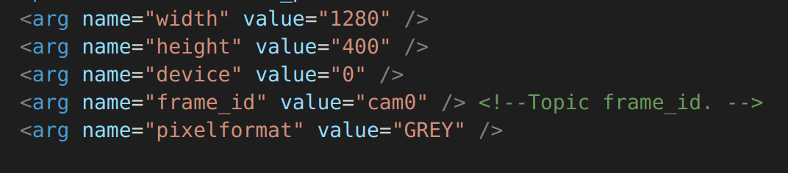

## Driver Installation
Follow these two tutorials to install and test the camera: [Camera Driver Installation](https://www.arducam.com/docs/camera-for-jetson-nano/mipi-camera-modules-for-jetson-nano/driver-installation/), [Camera Demonstration](https://www.arducam.com/docs/camera-for-jetson-nano/mipi-camera-modules-for-jetson-nano/camera-demonstration/)

## Install ROS

Follow this tutorial to install ROS: [Installation](http://wiki.ros.org/melodic/Installation/Ubuntu)  

## Create ROS Workspace

Follow this tutorial to create a ROS workspace: [Create a ROS Workspace](http://wiki.ros.org/ROS/Tutorials/InstallingandConfiguringROSEnvironment#Create_a_ROS_Workspace)  

## Dependent Installation

```
wget https://bootstrap.pypa.io/get-pip.py && python get-pip.py
sudo pip install v4l2
sudo apt install ros-melodic-camera-info-manager-py
```

## Install arducam_stereo_camera package

Copy the arducam_stereo_camera folder to the src folder of the ROS workspace:  
```
cp -r arducam_stereo_camera ~/catkin_ws/src
cd ~/catkin_ws/ && catkin_make
```

## Run Stereo Pipeline

### Run camera
You can modify the launch parameters before running the camera.  
```
vim ~/catkin_ws/src/arducam_stereo_camera/launch/arducam_stereo_camera.launch
```
  
**Tip: You can use the `v4l2-ctl --list-formats-ext` command to view the existing resolution and pixelformat**  

Open two terminals, one running roscore and the other running camera  
```
roscore #run roscore

roslaunch arducam_stereo_camera arducam_stereo_camera.launch #run camera
```

### StereoCalibration
Refer to this document for stereo calibration: [How to Calibrate a Stereo Camera](http://wiki.ros.org/camera_calibration/Tutorials/StereoCalibration)  

example:  
The checkerboard size used here is 11x8, and the square size is 2cm
```
rosrun camera_calibration cameracalibrator.py --approximate 0.1 --size 11x8 --square 0.02 right:=/arducam/right/image_raw left:=/arducam/left/image_raw right_camera:=/arducam/right left_camera:=/arducam/left
```
After the calibration is complete, click commit to send the parameters to the camera node.

### Run stereo matching
Refer to this document for stereo matching: [stereo_image_proc](http://wiki.ros.org/stereo_image_proc)  

example:  
Open two terminals, one runs stereo_image_proc and the other runs image_view  
```
ROS_NAMESPACE=arducam rosrun stereo_image_proc stereo_image_proc
rosrun image_view stereo_view stereo:=/arducam image:=image_rect
```
You can also run rqt_reconfigure to dynamically configure the parameters of stereo matching  
```
rosrun rqt_reconfigure rqt_reconfigure
```  
**For more details, please refer to: [Choosing Good Stereo Parameters](http://wiki.ros.org/stereo_image_proc/Tutorials/ChoosingGoodStereoParameters#Start_the_stereo_processing_node)**
